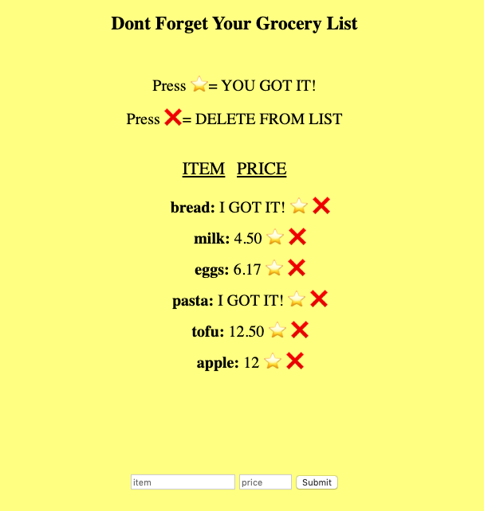

# ✅ Personal Express Grocery Shopping App
People live busy lives.  We are not able to get all of our shopping done at the same time.  So I made an handy app that keeps track of the groceries you have yet to buy. You can mark down when you have it.  So you dont have duplicates of anything.  You can also delete items. If you want to go with something healthier ;)

Tech Used:
- HTML5
- CSS3
- Javascript
- Node.js
- Express
- Mongo DB

## Installation

1. Clone repo
2. run `npm install`

## Usage

1. run `node server.js`
2. Navigate to `localhost:3000`
3. Have fun ;)
